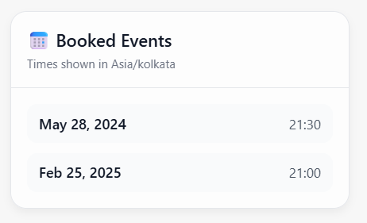
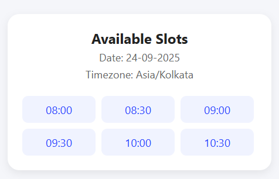

# **AI Meeting Scheduler**

An AI-powered conversational agent that helps users schedule meetings, list upcoming events, and interact with dynamically generated UI cards. Inspired by OpenAI’s ChatKit, this project enables an LLM to produce structured HTML-based cards alongside natural language responses—enhancing the clarity, usability, and interactivity of conversations.

---

## 🚀 **Features**

### **🗓️ Conversational Meeting Scheduler**

* Schedule meetings through natural language prompts.
* View upcoming meetings in a friendly, dialogue-driven experience.

### **📇 Runtime UI Card Generation**

The agent can generate interactive HTML cards during runtime.
Currently supported card types:

1. **List Upcoming Meetings Card**
2. **Schedule Meeting Success Card**
3. **List Available Time Slots Card**

These cards are stored and retrieved dynamically, allowing easy expansion for future card types.

### **🤖 LLM-Driven Logic**

* Uses an LLM to understand user queries and generate contextual UI elements.
* Brings intelligent, human-like handling of scheduling interactions.

---

## 🖼️ **Sample UI Cards**

Below are example UI cards generated by the agent:

### **📌 Upcoming Meetings Card**



### **📌 Meeting Booked Success Card**


### **📌 Available Time Slots Card**



---

## 🛠️ **Installation**

Clone the repository:

```bash
git clone https://github.com/NeelPatel31/AI-Meeting-Agent.git
cd AI-Meeting-Agent
```

Create and activate a virtual environment:

```bash
python3 -m venv venv
source venv/bin/activate   # On Windows: venv\Scripts\activate
```

Install dependencies:

```bash
pip install -r requirements.txt
```

---

## ▶️ **Usage**

Run the agent:

```bash
jupyter notebook
```

Then interact with the conversational interface to:

* Schedule a new meeting
* Check upcoming meetings
* View available time slots
* Receive UI-enhanced responses via HTML cards

The system will automatically fetch the required card templates at runtime.

---

## 📦 **Card Templates**

The project includes three HTML-based interactive cards:

| Card Type                | Description                                                           |
| ------------------------ | --------------------------------------------------------------------- |
| **Upcoming Meetings**    | Displays a list of all scheduled meetings in a clean UI format.       |
| **Schedule Success**     | Confirms that a meeting has been successfully created.                |
| **Available Time Slots** | Shows open time slots to help users pick an appropriate meeting time. |

These templates can be easily extended to support additional UI components.

---

## 💡 **Inspiration**

This project is inspired by **OpenAI’s ChatKit**, which enables agents to generate UI elements (cards, controls, forms) alongside text. The goal is to provide a similar hybrid conversational-UI experience using a custom agent.

---

## 🤝 **Contributing**

Contributions are welcome!
You can help by improving card templates, enhancing the LLM prompt logic, or adding support for more UI card types.